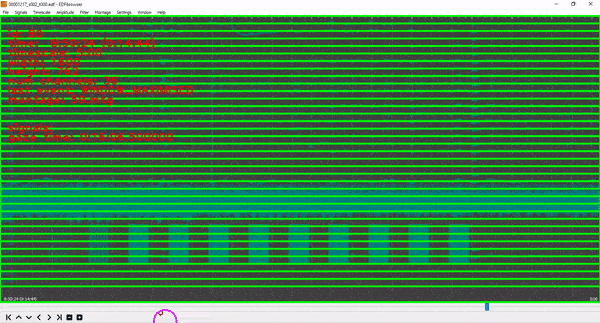

# TEETACSI
Code for acquiring and analysing data for the TEETACSI project (Tracking Expert Eyes to Train AI for Clinical Signal Interpretation)


# Data Acquisition

## Installation (Windows)
The TEETACSI project acquires eye tracking data using the Tobii Pro Nano, 
a modified version of [OpenSCORE](https://github.com/DWonGH/OpenSCORE), a modified version of 
[EDFBrowser](https://github.com/d3-worgan/edfbrowser) and the TUEG EEG dataset for analysis.

Download the TUEG data set for analysis using the [TUEG Tools](https://github.com/DWonGH/tueg-tools).

Then install the Tobii Pro Nano or eye tracker physically on the laptop. Instructions for setting up the Tobii can be 
found in the [manual](https://www.tobiipro.com/siteassets/tobii-pro/user-manuals/tobii-pro-nano-user-manual.pdf/?v=2.0).

Then the eye tracker drivers need to be installed and the tracker calibrated. [Download](https://www.tobiipro.com/product-listing/eye-tracker-manager/) 
the Tobii Eye Tracker Manager and follow the instructions to install the drivers and do an initial calibration.

Next install this repo locally. E.g. Open a PowerShell terminal:
```shell script
git clone https://github.com/DWonGH/TEETACSI.git
cd TEETACSI
git submodule init
git submodule update
```

The OpenSCORE and EDFBrowser need to be setup and installed to view the reports and analyse EEG's. OpenSCORE works with python 
3.6 and the requirements described in the requirements.txt file. It is recommended to use a conda virtual environment. E.g. 
in the PowerShell terminal:
```shell script
conda create -y -n teetacsi python=3.6
conda activate teetacsi
pip install -r .\OpenSCORE\requirements.txt
```

There are also some separate requirements for processing the captured data
```shell script
pip install -r .\requirements.txt
```

To install EDFBrowser, download and extract the [latest release](https://github.com/d3-worgan/edfbrowser/releases) from 
the git repository to the root directory of OpenSCORE. There should then be a directory in the root of OpenSCORE called 
```edfbrowser```, with the ```edfbrowser.exe``` and other ```.dll```s inside.

## Usage
The required EEG's from the TUEG data set must be specified in a ```.txt``` file; like the example in ```specified_paths.txt```. 
Replace the examples in the ```specified_paths.txt``` file with the required ```.edf``` locations for the session. 

Then run OpenSCORE in PowerShell. E.g. 
```shell script
.\run_openscore.ps1
```

To load the EEG's specified in the ```specified_paths.txt``` file, go to ```File->Load EEG Sequence```. In the dialog
enter the interpreter name. A suggested output path will be automatically generated; targeting the TEETACSI data directory.
Otherwise specify the required output directory. Finally give the location of the specified paths file that was created earlier. 

After this, a 'mirror' directory structure reflecting the ```specified_paths.txt``` wil have been generated in the output location.
Each ```.edf``` will be loaded into OpenSCORE and the reports can be navigated using the ```Previous```, ```Next``` buttons.
Press ```Open in EDFBrowser``` to start analysing the EEG recording. The eye tracker calibration and users head position can be managed
or checked using the ```Calibrate``` button. Press the ```Record Gaze``` button to start recording eye data, and make sure
to press the ```Stop Gaze``` button and close EDFBrowser before moving to the next EEG.

While in the session, each time EDFBrowser is opened a new timestamped directory will be created in the mirror output directory containing the UI 
tracking data. The eye tracking data will be saved to the same location. The score report will also be saved to the mirror 
automatically when switching between recordings.

# Data Verification & Acquisition
Once a sequence of EEG's have been analysed with the score reports, gaze data, and UI tracking saved; validate the recordings
and generate the final data set by using the tools in the ```reprojecting``` directory.

This command will play the UI and eye tracking data for a particular session log.
```shell script
python reprojecting\reproject.py --input <path_to_output_mirror_directory\path_to_timestamped_log_directory> --playback
```

This will produce a ```.avi``` video file for a recording in the mirror directory which can be played back for verification.
Creating video files like these are massive, like around a GB per minute. Need to change the codec or compress the video
afterwards to avoid this.
```shell script
python reprojecting\reproject.py --input <path_to_output_mirror_directory\path_to_timestamped_log_directory> --video
```
